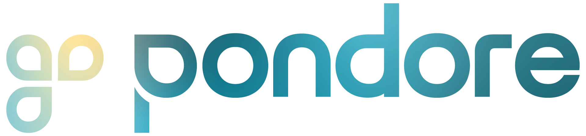
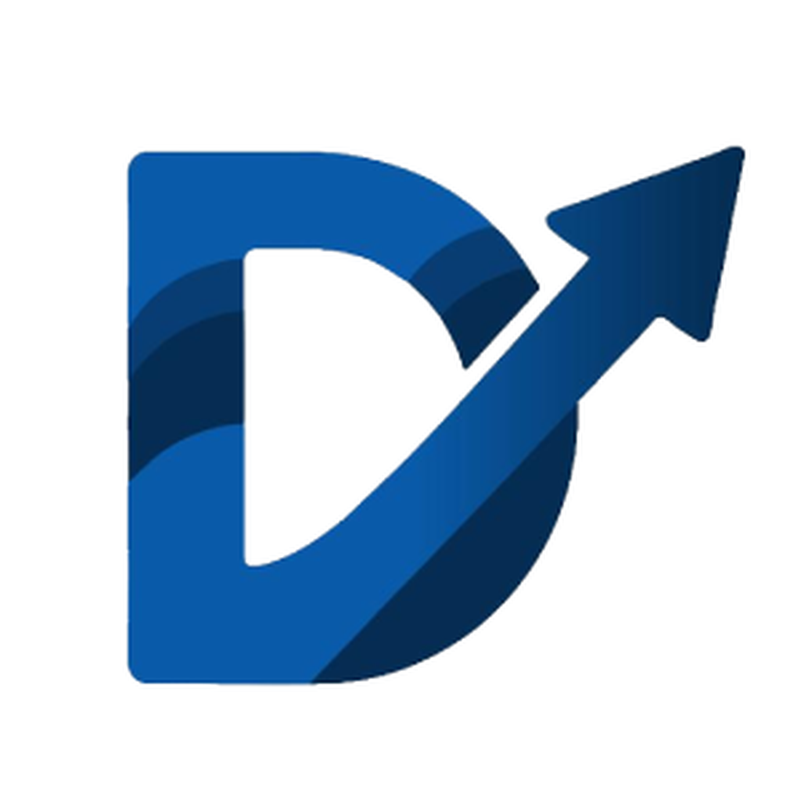

<h2 align="center">Hi, I'm Dom</h2>

&nbsp;
&nbsp;

Software engineer based in Vienna, Austria, experienced across backend development, networking, and security. 
I build software that helps teams make better decisions, and I run a company to do it.

---

 

<table>
<tr>
<td width="100" align="center">

</td>
<td>

**Pondore** - [pondore.at](https://pondore.at)

My company. We design and build software products that help businesses work more efficiently.

</td>
</tr>
<tr>
<td width="100" align="center">

</td>
<td>

**DecTrack** - [dectrack.com](https://dectrack.com)

A decision-making platform for teams. Explore options, gather structured opinions, and reach decisions with clarity so you can spend less time in meetings and more time shipping.

</td>
</tr>
</table>
